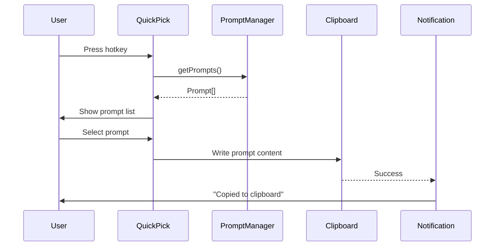

# PBI-2: Quick Prompt Selection

[View in Backlog](../backlog.md#user-content-2)

## Overview

This PBI implements the primary user-facing feature: a hotkey-triggered quick pick that allows users to rapidly select a prompt and copy it to their clipboard. This is the core workflow that makes Instaprompt valuable for daily use.

## Problem Statement

Even with saved prompts, users need a fast way to access them without navigating through menus. The ideal workflow is: press a hotkey, pick a prompt, and have it ready to paste immediately.

## User Stories

1. As a user, I want to press a keyboard shortcut to open a prompt selector so that I can quickly access my prompts.
2. As a user, I want to see my prompts in a searchable dropdown so that I can find the right one quickly.
3. As a user, I want the selected prompt to be copied to my clipboard automatically so that I can paste it immediately.
4. As a user, I want visual confirmation when a prompt is copied so that I know the action succeeded.
5. As a user, I want to customize the hotkey so that it doesn't conflict with my other shortcuts.

## Technical Approach

### New Command
| Command ID | Title | Keybinding | Description |
|------------|-------|------------|-------------|
| `instaprompt.selectPrompt` | Instaprompt: Select Prompt | `Ctrl+Shift+I` (customizable) | Open prompt picker and copy selection |

### Flow

### Implementation Details
- Quick Pick with fuzzy search enabled
- Show prompt name as label, first line of content as description
- Copy raw content to clipboard (template processing in PBI 3)
- Information message on successful copy

## UX/UI Considerations

- Default keybinding should be memorable but unlikely to conflict (`Ctrl+Shift+I`)
- Quick Pick should support type-to-filter for fast searching
- Show prompt preview (truncated content) in the picker
- Toast notification should be brief and non-intrusive

## Acceptance Criteria

1. `Ctrl+Shift+I` (or configured keybinding) opens the prompt quick pick
2. Quick pick shows all saved prompts with name and content preview
3. Typing filters prompts by name
4. Selecting a prompt copies its content to clipboard
5. Information notification confirms successful copy
6. Escape key dismisses the quick pick without action
7. Keybinding is customizable via VS Code keybindings

## Dependencies

- PBI 1: Core Prompt Management (must have prompts to select)

## Open Questions

None at this time.

## Related Tasks

See [Tasks for PBI 2](./tasks.md)

