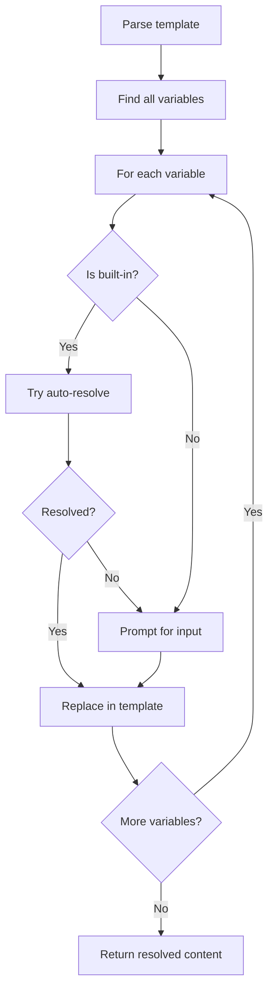

# PBI-3: Template Variable Support

[View in Backlog](../backlog.md#user-content-3)

## Overview

This PBI adds template variable support to prompts, allowing users to include dynamic placeholders like `{FILENAME}`, `{SELECTION}`, and `{TASK}` that are automatically resolved from the current editor context. Variables that cannot be auto-resolved will prompt the user for manual input.

## Problem Statement

Static prompts are limiting. Users often need to include contextual information like the current file name, selected code, or task identifier. Without template support, users must manually edit prompts each time, defeating the purpose of saved prompts.

## User Stories

1. As a user, I want to use `{FILENAME}` in my prompts so that the current file name is automatically inserted.
2. As a user, I want to use `{SELECTION}` in my prompts so that my selected text is automatically inserted.
3. As a user, I want to use `{TASK}` in my prompts so that the current task ID is extracted from open task files.
4. As a user, I want to define custom variables like `{MY_VAR}` and be prompted for their values.
5. As a user, I want unresolved built-in variables to fall back to manual input so that my workflow isn't blocked.

## Technical Approach

### Template Syntax
- Variables use curly brace syntax: `{VARIABLE_NAME}`
- Variable names are uppercase with underscores
- Regex pattern: `\{([A-Z_]+)\}`

### Built-in Variables
| Variable | Description | Resolution Strategy |
|----------|-------------|---------------------|
| `{FILENAME}` | Current file name | `activeTextEditor.document.fileName` |
| `{FILEPATH}` | Full file path | `activeTextEditor.document.uri.fsPath` |
| `{SELECTION}` | Selected text | `activeTextEditor.selection` content |
| `{CLIPBOARD}` | Clipboard content | `env.clipboard.readText()` |
| `{LINE}` | Current line number | `activeTextEditor.selection.active.line + 1` |
| `{TASK}` | Task ID from open file | Parse open `*-*.md` files in `docs/delivery/` |

### TASK Variable Resolution
1. Scan visible text editors for markdown files
2. Match pattern: file path contains `docs/delivery/` and filename matches `\d+-\d+\.md`
3. Extract task ID from filename (e.g., `1-3.md` → `1-3`)
4. If multiple matches, use the most recently focused
5. If no match, fall back to manual input

### Template Engine Module
```typescript
// src/templateEngine.ts
interface VariableResolver {
  name: string;
  resolve: () => Promise<string | undefined>;
}

async function resolveTemplate(content: string): Promise<string>;
function parseVariables(content: string): string[];
```

### Resolution Flow


## UX/UI Considerations

- Variables should be visually distinct when displayed (if showing preview)
- Manual input prompts should show the variable name and context
- Allow cancellation during manual input (returns to picker without copying)
- Show placeholder text explaining what value is expected

## Acceptance Criteria

1. `{FILENAME}` resolves to current file name without path
2. `{FILEPATH}` resolves to full file path
3. `{SELECTION}` resolves to currently selected text (empty string if none)
4. `{CLIPBOARD}` resolves to current clipboard content
5. `{LINE}` resolves to current line number (1-indexed)
6. `{TASK}` attempts to find task ID from open task files, prompts if not found
7. Unknown variables prompt for manual input
8. User can cancel during manual input
9. Template with no variables copies as-is
10. Multiple occurrences of same variable resolve once, replace all

## Dependencies

- PBI 1: Core Prompt Management (prompts to apply templates to)
- PBI 2: Quick Prompt Selection (integration point for template resolution)

## Open Questions

None at this time.

## Related Tasks

See [Tasks for PBI 3](./tasks.md)

