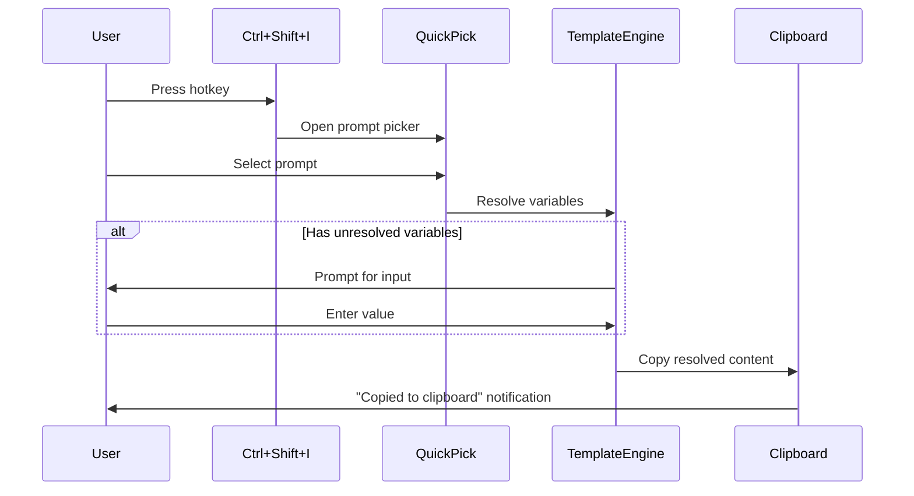
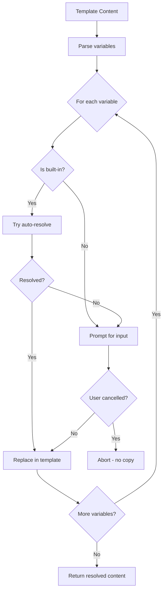

# Instaprompt - Product Requirements Document

**Version**: 1.0  
**Created**: 2025-12-24  
**Status**: Draft

## Executive Summary

Instaprompt is a VS Code extension that enables users to save, manage, and quickly access AI prompts via keyboard shortcuts. It supports template variables that auto-fill from editor context, making prompts dynamic and contextual.

## Problem Statement

Developers and AI users frequently reuse the same prompts when working with AI assistants. Currently, users must:
- Manually copy prompts from external files or notes
- Remember and retype common prompts
- Manually fill in contextual information like file names or task IDs

This is inefficient, error-prone, and breaks the workflow.

## Vision

A seamless prompt management experience within VS Code where users can:
1. Save prompts once and access them instantly via hotkey
2. Use template variables that auto-fill from context
3. Never leave their editor to manage AI interactions

## Target Users

- Developers using AI coding assistants (Cursor, GitHub Copilot, ChatGPT, etc.)
- Technical writers creating documentation with AI assistance
- Anyone who frequently reuses structured prompts

## Core Features

### 1. Prompt Storage and Management

**User Stories**:
- As a user, I want to save prompts with a name and content so I can reuse them
- As a user, I want to edit and delete prompts to keep my collection organized
- As a user, I want prompts to persist globally across all workspaces

**Requirements**:
- CRUD operations for prompts via quick pick commands
- Global storage using VS Code's extension API
- Support for optional categories/tags (future enhancement)

### 2. Quick Prompt Selection

**User Stories**:
- As a user, I want to press a hotkey to open a prompt picker
- As a user, I want to search/filter prompts quickly by typing
- As a user, I want the selected prompt copied to my clipboard automatically

**Requirements**:
- Configurable keyboard shortcut (default: `Ctrl+Shift+I`)
- Fuzzy search in quick pick
- Automatic clipboard copy on selection
- Visual confirmation notification

### 3. Template Variable Support

**User Stories**:
- As a user, I want to use `{FILENAME}` to insert the current file name
- As a user, I want to use `{SELECTION}` to insert selected text
- As a user, I want to use `{TASK}` to auto-detect task ID from open files
- As a user, I want custom variables to prompt for manual input

**Requirements**:
- Template syntax: `{VARIABLE_NAME}` (uppercase with underscores)
- Built-in variables that auto-resolve from editor context
- Manual input fallback for unresolved or custom variables
- Graceful handling of cancellation during input

## Built-in Template Variables

| Variable | Description | Resolution |
|----------|-------------|------------|
| `{FILENAME}` | Current file name (no path) | Active editor document |
| `{FILEPATH}` | Full file path | Active editor document |
| `{SELECTION}` | Currently selected text | Active editor selection |
| `{CLIPBOARD}` | Current clipboard content | System clipboard |
| `{LINE}` | Current line number (1-indexed) | Active editor cursor |
| `{TASK}` | Task ID from open file | Parse `docs/delivery/*/*.md` files |

## User Interface

### Commands

| Command | Title | Keybinding |
|---------|-------|------------|
| `instaprompt.selectPrompt` | Instaprompt: Select Prompt | `Ctrl+Shift+I` |
| `instaprompt.addPrompt` | Instaprompt: Add Prompt | - |
| `instaprompt.editPrompt` | Instaprompt: Edit Prompt | - |
| `instaprompt.deletePrompt` | Instaprompt: Delete Prompt | - |
| `instaprompt.listPrompts` | Instaprompt: List Prompts | - |

### Workflow Diagrams

#### Main Selection Flow



#### Template Resolution Flow



## Technical Architecture

### Extension Structure

```
instaprompt/
├── package.json              # Extension manifest
├── tsconfig.json             # TypeScript config
├── .vscodeignore             # Publishing ignore
├── src/
│   ├── extension.ts          # Entry point, command registration
│   ├── promptManager.ts      # CRUD operations, globalState storage
│   ├── templateEngine.ts     # Variable parsing and resolution
│   └── types.ts              # TypeScript interfaces
└── docs/
    └── ...                   # Delivery documentation
```

### Data Model

```typescript
interface Prompt {
  id: string;           // Unique identifier (timestamp + random)
  name: string;         // User-friendly name
  content: string;      // Prompt content with optional template variables
  category?: string;    // Optional category for organization
  createdAt: number;    // Creation timestamp
  updatedAt: number;    // Last update timestamp
}
```

### Storage

- **Location**: VS Code `ExtensionContext.globalState`
- **Key**: `instaprompt.prompts`
- **Format**: JSON array of Prompt objects
- **Scope**: Global (available across all workspaces)

## Non-Functional Requirements

### Performance
- Quick pick should open within 100ms of hotkey press
- Template resolution should complete within 500ms for built-in variables

### Compatibility
- VS Code version: 1.74.0 or higher
- Platforms: Windows, macOS, Linux

### Usability
- All operations accessible via command palette
- Clear error messages for edge cases
- Non-blocking notifications

## Success Metrics

1. **Adoption**: Number of extension installs
2. **Engagement**: Average prompts saved per user
3. **Efficiency**: Time saved vs. manual prompt management (qualitative)

## Future Enhancements (Out of Scope for v1.0)

- [ ] Prompt categories/folders for organization
- [ ] Import/export prompts as JSON
- [ ] Sync prompts across machines via Settings Sync
- [ ] Prompt snippets with tab stops
- [ ] Custom variable definitions in settings
- [ ] Prompt sharing via gists

## Delivery Roadmap

| PBI | Title | Priority | Dependency |
|-----|-------|----------|------------|
| 1 | Core Prompt Management | High | None |
| 2 | Quick Prompt Selection | High | PBI 1 |
| 3 | Template Variable Support | High | PBI 1, 2 |

See [Product Backlog](./delivery/backlog.md) for detailed PBI breakdown.

## Appendix

### Example Prompts

**Simple prompt (no variables)**:
```
Review this code for potential bugs and suggest improvements.
```

**Prompt with built-in variables**:
```
I'm working on {FILENAME}. Here's the code I've selected:

{SELECTION}

Please explain what this code does and suggest any improvements.
```

**Prompt with TASK variable**:
```
Continue working on task {TASK}. The current status and requirements are in the task file.
```

**Prompt with custom variable**:
```
Write unit tests for the {FUNCTION_NAME} function focusing on edge cases.
```

